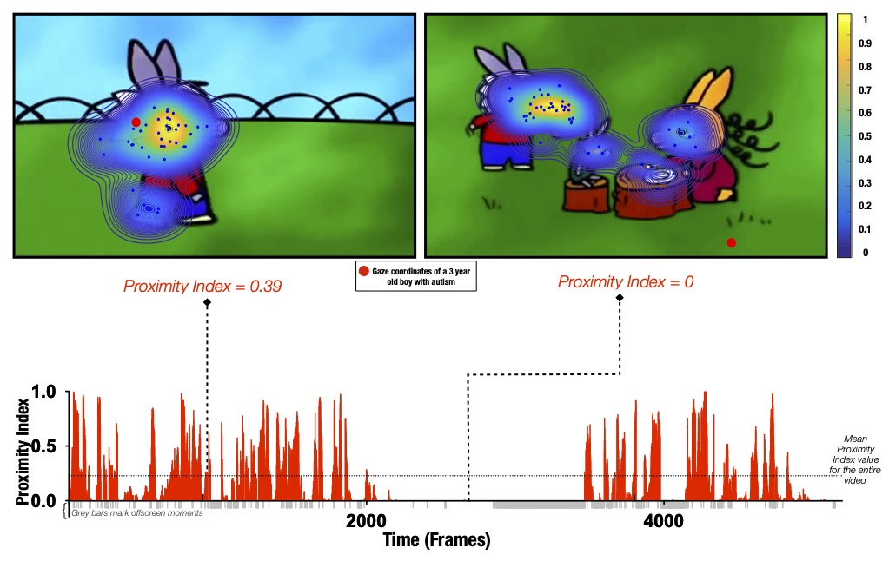

# Proximity Index Calculation Method

## Overview
This document describes the method for calculating the Proximity Index (PI),
an eye-tracking derived measure quantifying divergence in visual exploration in a data-driven manner. The method compares gaze patterns
between a referent group and a comparison group, applicable in various research contexts.

## Method Description
- The method first generates referent gaze patterns using a probability density estimation
  function [(Botev et al., 2010)]( https://doi.org/10.1214/10-AOS799) on the gaze data of the referent group. These referent patterns then serve as a benchmark for comparison. It then calculates the PI for each gaze data frame for individuals in the comparison group. PI values are scaled from 0 to 1, where lower values indicate higher divergence.

## Requirements
- Matlab (any release)

## Input Data Format
  The function requires a 3D array input with the following dimensions: Gaze Coordinates (2D) X Number of Frames X Number of Subjects
## Illustration

*Proximity Index method illustration. Referent gaze data distribution ("reference") was created using gaze coordinates from 51 TD males (aged 3.48±1.29 years old).
Upper row: two example frames with gaze coordinates of TD children (blue dots) used to define the "reference" (delimited by contours) and gaze data from a three-year-old male with ASD (whose gaze coordinates are depicted as a red circle). Hotter contour color indicates the area of higher density of distribution of gaze in the TD group, meaning that a particular area was more appealing for a higher number of TD preschoolers for the given frame; the Proximity Index value for the three-year-old male with ASD for the frame on the left had a value of 0.39 and for the frame on the right a value of 0.  Lower row: Proximity Index values for the visual exploration of the three-year-old boy with ASD over the entire video with mean Proximity Index value indicated by the dashed red lines..*

## References

 "Unraveling the Developmental Dynamic of Visual Exploration of Social Interactions in Autism"
 N. Kojovic, S. Cekic, S.H. Castañón, M. Franchini, H.F. Sperdin, C. Sandini,
 R.K. Jan, D. Zöller, L. Ben Hadid, D. Bavelier, M. Schaer
 bioRxiv 2020.09.14.290106; doi: https://doi.org/10.1101/2020.09.14.290106
## Applications

The PI method has been used in the following papers:

- Sperdin, H. F., Coito, A., Kojovic, N., Rihs, T. A., Jan, R. K., Franchini, M., Plomp, G., et al. (2018). “Early Alterations of Social Brain Networks in Young Children with Autism.” Edited by J.-M. Ramirez. eLife, 7 (February), e31670. https://doi.org/10.7554/eLife.31670.
- Jan, R. K., Rihs, T. A., Kojovic, N., Sperdin, H. F., Franchini, M., Custo, A., Tomescu, M. I., Michel, C. M., & Schaer, M. (2019). “Neural Processing of Dynamic Animated Social Interactions in Young Children With Autism Spectrum Disorder: A High-Density Electroencephalography Study.” Frontiers in Psychiatry, 10. https://doi.org/10.3389/fpsyt.2019.00582.
- Kojovic, N., Ben Hadid, L., Franchini, M., & Schaer, M. (2019). “Sensory Processing Issues and Their Association with Social Difficulties in Children with Autism Spectrum Disorders.” Journal of Clinical Medicine, 8(10), 1508. https://doi.org/10.3390/jcm8101508.
- Dubourg, L., Kojovic, N., Eliez, S., Schaer, M., & Schneider, M. (2023). “Visual Processing of Complex Social Scenes in 22q11.2 Deletion Syndrome: Relevance for Negative Symptoms.” Psychiatry Research, 321 (March), 115074. https://doi.org/10.1016/j.psychres.2023.115074.
- Wang, X., Delgado, J., Marchesotti, S., Kojovic, N., Sperdin, H. F., Rihs, T. A., Schaer, M., & Giraud, A.-L. (2023). “Speech Reception in Young Children with Autism Is Selectively Indexed by a Neural Oscillation Coupling Anomaly.” Journal of Neuroscience, 43(40), 6779–95. https://doi.org/10.1523/JNEUROSCI.0112-22.2023.
